# Introduction to VEXcode V5 Blocks

This guide provides an introduction to the basics of VEXcode Blocks. If you prefer video tutorials, you can also check out our [video guide](https://github.com/9204A-B/intro-block?tab=readme-ov-file#video-guide).

## Getting Started
Start by downloading VEXcode from [here](https://link.vex.com/vexcode-v5blocks-windows), or you can use VEXcode online [here](https://codev5.vex.com/).

How to Set up VEXcode

   
  Simply follow the provided link, run the .exe file, and agree to the terms.
   

How to Set up VEXcode Online

   
  No setup required! Just follow the provided link.   

  Note: VEXcode online works only with Chromium-based browsers such as Chrome, Edge, Opera, etc. Firefox and Safari are not compatible.
 

Once installed, VEXcode should look like this:
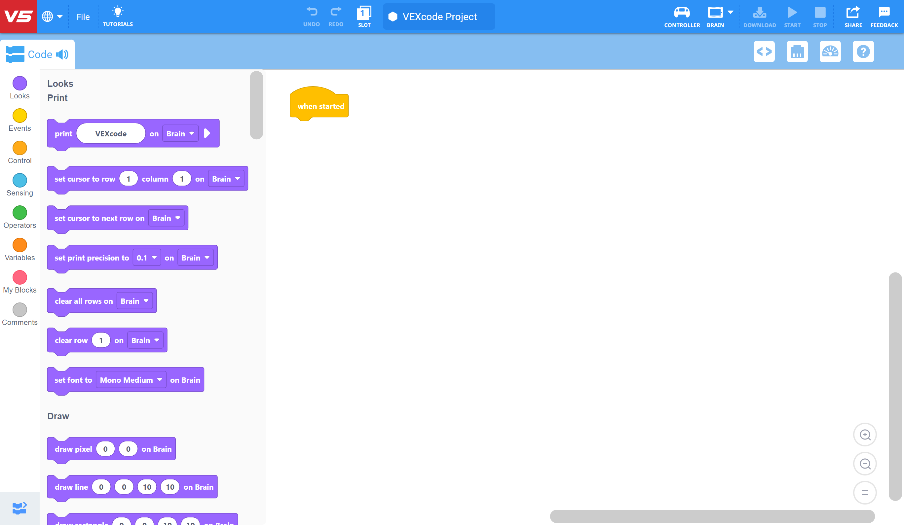

## Using the App
### Slots
You can select the slot on the brain where your program will be saved. 
Note: that uploading code will overwrite any other programs stored in that slot. The brain can store a maximum of 8 programs.  
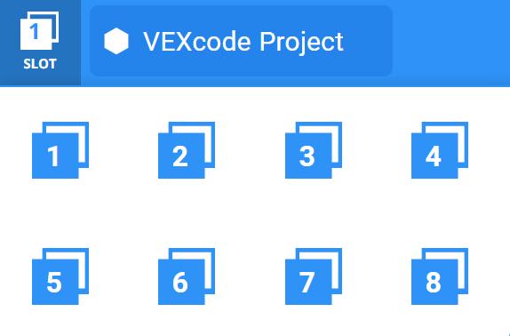

### Project Name
To the right of the slots button, you can click the project name (appears as VEXcode Project) to rename it before uploading it to the brain.
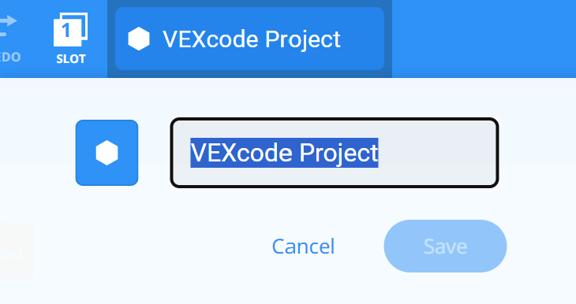

### Initializing Devices
To get started, you need to add the devices first, otherwise, the corresponding blocks won't appear.  
Begin by selecting the 2nd option below the run and download options.  
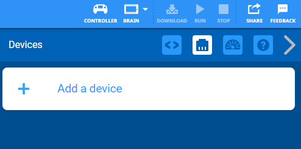  
For instance, let's configure a simple drivetrain.  
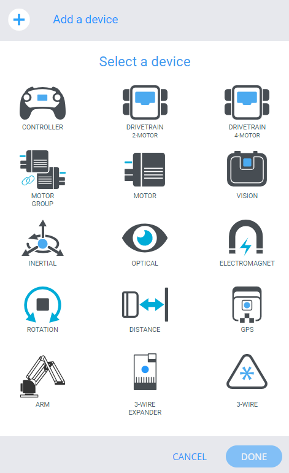   
Choose a drivetrain object, not just a motor.  
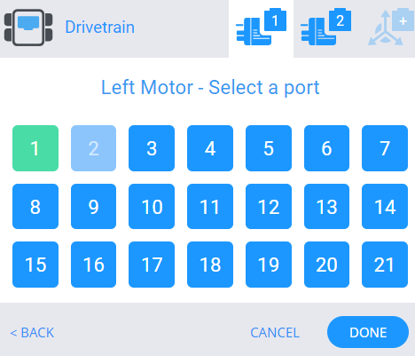  
Select the ports the motors are connected to.  
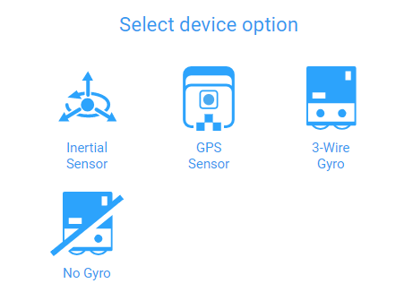  
99.9% of the time you'll select No Gyro.  
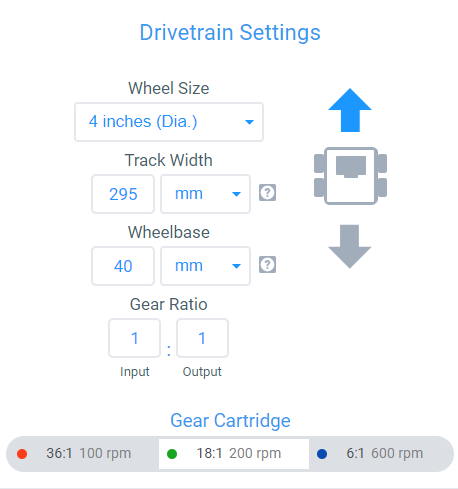  
While setting up these measurements is not mandatory, they can be helpful for Auton. One useful option here is the ability to reverse motors using the robot icon on the right side.  
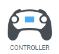  
Next, add a controller.  
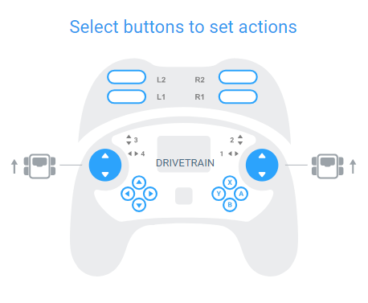  
Simply click the joystick icons to go through different drivetrain setups.  
At this point, you can upload the code by connecting the robot and hitting download.

### Simple Program Example
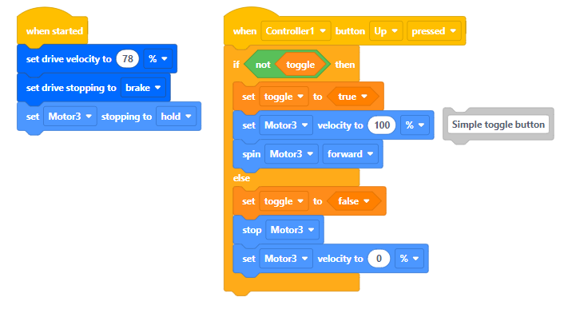  
Here's an example of an initialized drivetrain, controller, and a motor.  
The toggle button example allows the motor to spin until you press the button again.

### Running Your Program  
There are two ways to run your program once it's uploaded to the brain.

**From the Controller**  
  
Navigate using the arrow keys, select programs, navigate to the selected slot, and hit run.

**From the Brain**  
  
Click on the program at the bottom or select the programs folder to see everything.

## Summary
This guide serves as a good starting place for those unfamiliar with VEXcode or text coding.  
For basic competition code, consider exploring [Python](https://github.com/9204A-B/intro-python/), as it's relatively easy to learn.  
For more complex configurations, [C++](https://github.com/9204A-B/intro-Cpp) is recommended for better code organization.

## Video Guide
Check out our [YouTube Guide](https://youtube.com/playlist?list=PLkJYTVlbDhUbdypypS46la5xFOnpnOFFX&si=pMRX561FNS6AxHgY).

## Authors
- [Logan Dresel](https://github.com/coollogan876)
